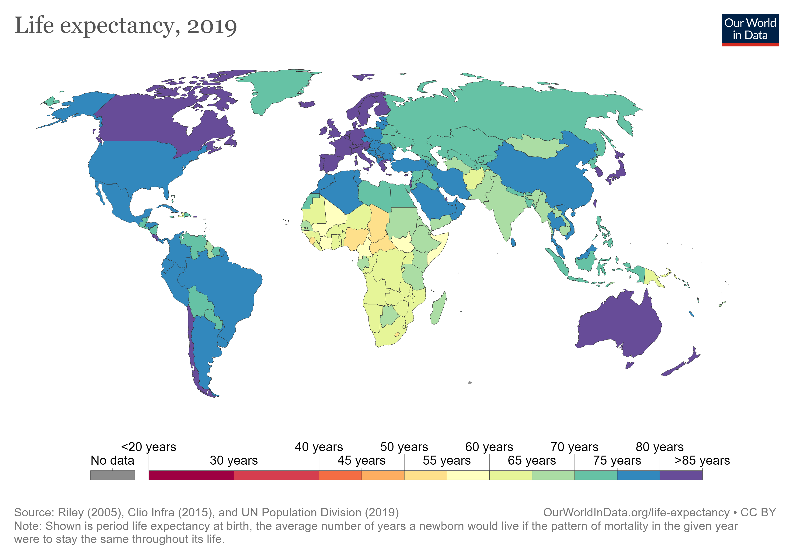

```{r setup, include=FALSE}
# Use this chunk to quietly load your packages

knitr::opts_chunk$set(
	fig.align = "center",
	message = FALSE,
	warning = FALSE
)
# Packages loaded in this chunk will not appear in the presentation. 
library(readr)
library(readxl)
library(tidyr)
library(dplyr)
library(epitools)
library(knitr)
library(ggplot2)
library(Hmisc)
library(psychometric)
library(cowplot)


```


# Introduction

The gross domestic product per capita, or GDP per capita, is a measure of a country's economic output that accounts for its number of people. It divides the country's gross domestic product by its total population. GDP per capita is an important indicator of economic performance and a useful unit to make cross-country comparisons of average living standards and economic wellbeing.

Life expectancy at birth is defined as how long, on average, a newborn can expect to live, if current death rates do not change. Life expectancy at birth is one of the most frequently used health status indicators. 

Large inequalities in life expectancy by countries exist in the world. The big differences in health across the world is clearly visible in the following illustration:

<br>
<center>

<center>
<center>*Source:https://ourworldindata.org/life-expectancy*<center>
<br>


# Introduction Cont.

**Do citizens of wealthier countries live longer?**

- Do people live longer in countries with a high GDP per capita? Does economic development raise life expectancy?

To answer this, we wanted to investigate the relation between GDP per Capita and the life expectancy of the citizen in the developed countries. 

- To have broad coverage, instead of G7 or G20, we focused our investigation on OECD (Organisation for Economic Co-operation and Development) countries which is an association of 37 nations in Europe, North America, and the Pacific. Generally, OECD members are high-income economies with a very high Human Development Index (HDI) and are regarded as developed countries.


# Problem Statement

The question that we want to investigate is:

**“Is there any relationship between a country’s GDP per Capita and Life Expectancy?”**

To answer this, we:

- First, started with descriptive statistics to summarise the characteristics of
data and used statistical visualizations to examine important features.
- Second, a correlation analysis is performed to understand the nature of any 
existing relationship.
- Third, a linear regression model was applied to predict the dependent variable,
Life Expectancy, using measures of GDP per capita.
- Finally, reached the conclusion, if the relationship was statistically 
significant or not.


# Data

A detailed description of datasets considered for data preprocessing, their sources, and variable descriptions are as follows:

#### Dataset Source

- We have collected Life Expectancy data from 2000 to 2019 data from the following source:
https://data.oecd.org/healthstat/life-expectancy-at-birth.htm
- And, GDP Per Capita 2000 to 2019 for the OECD countries from the following source:
https://data.oecd.org/gdp/gross-domestic-product-gdp.htm

#### The datasets contained:

- ‘LOCATION’: Three-letter country codes defined in ISO, a standardized way to represent a country name.
- ‘INDICATOR’: Indicator information- 'GDP' in GDP dataset 'LIFEEXP' in Life Expectancy dataset.
- 'SUBJECT': 'TOT' to indicate the Total level.
- 'MEASURE': 'USD_CAP' in GDP dataset to indicate that values are in USD per Capita. 'Y' Life Expectancy dataset to indicate the values are in Years.
- 'FREQUENCY': 'A' to indicate Yearly measure
- 'TIME': Year of measurement
- 'Value': GDP per Capita in USD (GDP dataset) and Life Expectancy in Years (Life Expectancy dataset) 
- 'Flag Codes': Contains code for countries


# Data Cont.

- To select only the variables that we would need for the analysis, we considered only ‘LOCATION’, ‘TIME’, and 'Value' in each dataset. 
- Renamed the ’TIME’ column of both the data sets to ‘YEAR’ and renamed the “VALUE’ to more intuitive names ‘GDP’ and ‘LIFEEXP’ in the respective datasets.
- Initial inspection revealed that the majority country did not have Life Expectancy data for the year 2019, so only considered the 2000 to 2018 period for both the datasets. 
- Both the datasets were in a tidy format, so we merged both the datasets named it as 'gdp_lifeexp_data'.
- 'GDP' and 'LIFEEXP' were in numeric class and this was suitable for the analysis.
- Data scanning revealed that there were 3 missing values in the Life Expectancy variable. Upon investigating further, we had decided to omit the records with missing values from the analysis instead of recoding these missing values with the mean values.
- Post data-preprocessing, the final dataset contained 700 observations. We have uploaded the data final pre-processed data to the Kaggle site for easy reference: https://www.kaggle.com/rajibrd/gdp-and-life-expectancy-of-oecd-countries

```{r}

newdata <- read_excel("gdp_lifeexp_data.xlsx")
head(newdata)


```


# Descriptive Statistics

- GDP per Capita ranges from USD 6777 to USD 116622.
- Life Expectancy varies from 70.1 to 84.2 years old.

```{r}
summary1 <- newdata %>% summarise(Min = min(GDP,na.rm = TRUE), Q1 = quantile(GDP,probs = .25,na.rm = TRUE),
                       Median = median(GDP, na.rm = TRUE), Q3 = quantile(GDP,probs = .75,na.rm = TRUE),
                       Max = max(GDP,na.rm = TRUE), Mean = mean(GDP, na.rm = TRUE),
                       SD = sd(GDP, na.rm = TRUE), n = n(),
                       Missing = sum(is.na(GDP)))
knitr::kable(summary1,caption="Summary Statistics for GDP per Capita")

summary2 <- newdata %>% summarise(Min = min(LIFEEXP,na.rm = TRUE), Q1 = quantile(LIFEEXP,probs = .25,na.rm = TRUE),
                                  Median = median(LIFEEXP, na.rm = TRUE), Q3 = quantile(LIFEEXP,probs = .75,na.rm = TRUE),
                                  Max = max(LIFEEXP,na.rm = TRUE), Mean = mean(LIFEEXP, na.rm = TRUE),
                                  SD = sd(LIFEEXP, na.rm = TRUE), n = n(),
                                  Missing = sum(is.na(LIFEEXP)))
knitr::kable(summary2,caption="Summary Statistics for Life Expentancy")
```


# Visualisation

- From the histogram, there seems to be a couple of observations higher than all
other observations in GDP and some observations are lower in LIFEEXP (Life Expectancy).
- The GDP per capita histogram is slightly right-skewed and the life expectancy is slightly left-skewed.
- The GDP histogram shows many outliers.

```{r, fig.height=4.5}
g1 <- ggplot(newdata,aes(GDP))+geom_histogram(bins=40,color = "yellow3", fill="yellow3")+ ylab('Frequency')+ggtitle('GDP Per Capita')
g2 <- ggplot(newdata,aes(LIFEEXP))+geom_histogram(bins=40,color = "brown", fill="brown")+ ylab('Frequency')+ggtitle('Life Expectancy')
cowplot::plot_grid(g1, g2, labels = "AUTO")
```


# Visualisation 2

- Plotted Boxplot to understand the data and identified the values of the potential outliers based on the IQR criterion.
- Further investigation (not shown here as it was part of data pre-processing) using a bivariate box plot revealed that there were no obvious outliers or abnormal observations when we included the respective country into consideration. Hence, there was no justifiable reason to remove these outliers. These outliers values are legitimate observations and we should leave it in the dataset. It would not be appropriate practice to remove valid  data points simply to produce a better fitting model or statistically significant results.

```{r, fig.height=4.5}
par(mfrow = c(1,2))
boxplot(newdata$GDP, main="Boxplot of GDP PER CAPITA",col='yellow3', notch = T)
boxplot(newdata$LIFEEXP, main="Boxplot of Life Expectancy", col='brown', notch = T)
```
```{r, echo=FALSE}
boxplot.stats(newdata$GDP)$out %>% round ()
boxplot.stats(newdata$LIFEEXP)$out %>% round (1)
```

# Visualisation 3

- From the scatter plot, we can see that the data exhibit signs of a positive 
linear relationship

```{r}

plot(LIFEEXP ~ GDP, data = newdata, main="Scatter of Life Expectancy and GDP",
        ylab="Life Expectancy", xlab="GDP Per Capita", col=c('brown', 'yellow3'))
abline(lm(LIFEEXP ~ GDP, data = newdata))

```

# Hypothesis Testing 1

**Correlation Analysis**

**Hypothesis Generation**

Ho : There is no correlation between GDP per Capita of an OECD country and its Life Expectancy.

Ha : There is significant correlation between GDP per Capita of an OECD country and its Life Expectancy.

Mathematically,

Ho  :r = 0

Ha : r ≠ 0

# Test Result 1

A Pearson’s correlation was calculated to measure the strength of the linear
relationship between GDP per capita of a OECD country and its life expectancy. 
The positive correlation was statistically significant, r=.67, p<.001, 95% CI 
[0.628, .710].

We can say that there are statistically significant evidence to reject Ho.

```{r}

#Creating a correlation matrix
corr<-as.matrix(dplyr::select(newdata, LIFEEXP, GDP))
rcorr(corr, type = "pearson")
r=cor(newdata$LIFEEXP,newdata$GDP)
CIr(r = r, n = 700, level = .95) %>% round(3)
```

# Hypthesis Testing 2

As the data demonstrated evidence of a positive linear relationship, a linear 
regression model was fitted to predict the dependent variable, life expectancy, 
using measures of GDP per capita. Other non-linear trends were ruled out. 

**Linear Regression Model**

**Hypothesis Generation**

Ho: The data do not fit the linear regression model

Ha: The data fit the linear regression model


Mathematically,

Ho : α = 0

Ha : α ≠ 0

# Test Result 2

- As p<.001. So there was statistically significant evidence that per capita GDP
was positively related to life expectancy. Therefore, we reject Ho.
- Country's GDP per capita measure explained 45.02% of the variability in 
country's life expectancy.

```{r}
gdplifeexpmodel <- lm(LIFEEXP ~ GDP, data = newdata) # fitting the linear regression model using the lm() function
gdplifeexpmodel %>% summary()
gdplifeexpmodel %>% confint() # calculating 95% CI

```


# Assumptions validation for linear regression

- The relationship between fitted values and residuals is flat and the variance appears to remain the same. The red line in the Scale-Location plot is close to 
flat the variance in the square root of the standardized residuals appears to be
consistent. These two pieces of evidence support the assumption of homoscedasticity.
- The Q-Q plot exhibit signs of no major deviations from normality supporting that residuals are approximately normally distributed.
- In the Residual vs Leverage, there are no values that fall outside the bands, and therefore, no evidence of influential cases.

```{r, fig.height=3, fig.width=13.5}
par(mfrow=c(1,4))
plot(gdplifeexpmodel)
```


# Discussion

**Major Findings:**

- A linear regression model was fitted to predict the dependent variable, 
Life Expectancy (LIFEEXP), using measures of GDP per capita (GDP).
- Prior to fitting the regression, a scatter plot assessing the bivariate 
relationship between Life Expectancy and GDP per capita was inspected. 
The scatter plot demonstrated evidence of a positive linear relationship. 
Other non-linear trends were ruled out.
- The overall regression model was statistically significant,
F(1,698)= 571.6, p<.001, and explained 45.02% of the variability in country's 
Life Expectancy measure, R2=.4502.
- The estimated regression equation was LIFEEXP =(7.448e+01)+(1.321e-04)∗GDP.
- The positive slope for Life Expectancy was statistically significant, 
b=(1.321e-04), t(698)= 23.91, p<.001, 95% CI [1.212884e-04, 1.429922e-04].
- As p<.001, we can say there was statistically significant evidence that per 
capita GDP was positively related to life expectancy. Therefore, we reject Ho.
- So we can conclude that there is a significant correlation 
between GDP per Capita of an OECD country list and its Life Expectancy.
- Final inspection of the residuals supported normality and homoscedasticity.

# Discussion Cont.

- All countries make efforts to improve the health of their citizens, not with the same success though, resulting in large inequalities in life expectancy across countries.
- This study can provide valuable insights to policymakers, particular in the area of income, resource allocation, and health and population policies/programs. 
- We can extend this study further and delve into the relationship between Life Expectancy and Healthcare spending per capita to examine other determinants of health care expenditure.
- Further evaluation can be conducted to reduce the skewness in the distribution, taking roots or logarithms or reciprocals transformation to address right skewness and taking squares or cubes or higher powers to reduce left skewness. Box-Cox Transformation can also be useful in our case of linear regression analysis.


# References

- Statistics by Jim. c2020. Jim Frost. Consulted 11/10/20. Retrieved from:'https://statisticsbyjim.com/basics/remove-outliers/'
  
- Applied Analytics Course website. c2016. James Baglin. Module 9. Simple Linear Regression and Correlation. Updated 13/07/20. Consulted 11/10/20. Retrieved from:'https://astral-theory-157510.appspot.com/secured/MATH1324_Module_09.html'
  
- Our World in Data. Global Change Data Lab. Max Roser, Esteban Ortiz-Ospina and Hannah Ritchie (2013) - "Life Expectancy". Published online at OurWorldInData.org. Retrieved from: 'https://ourworldindata.org/life-expectancy' [Online Resource]

- Euromonitor International. c2020. Retrieved from: 'https://blog.euromonitor.com/economic-growth-and-life-expectancy-do-wealthier-countries-live-longer/'


